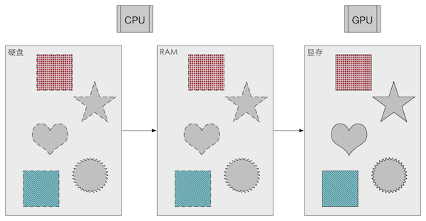
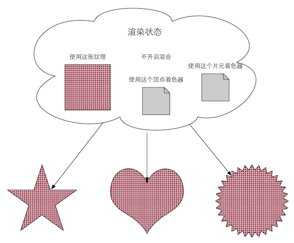
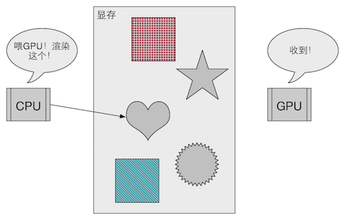
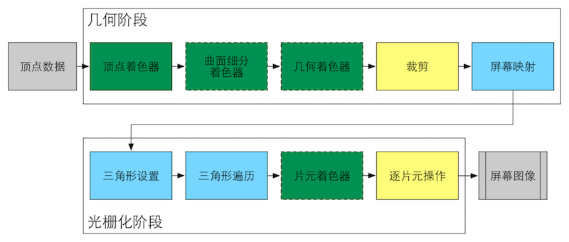
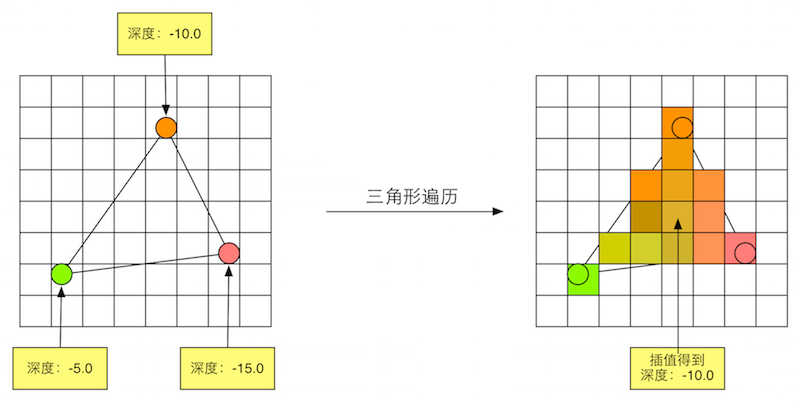
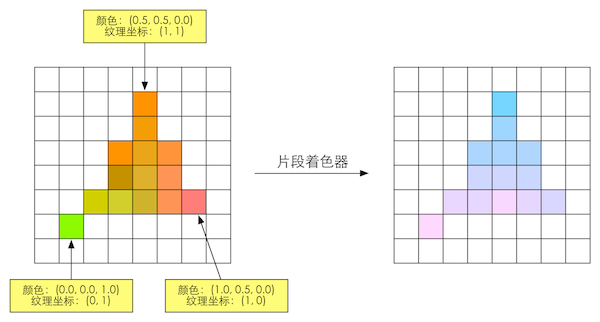

## 《Unity Shader入门精要》笔记（一）渲染流水线


----
#### 1、什么是渲染流水线？
渲染流水线的工作任务是：将三维场景里的物体投到屏幕上，生成一张二维图像。
可分为三个阶段：**应用阶段(Application Stage)、几何阶段(Geometry Stage)、光栅化阶段(Rasterizer Stage)**。


##### 1.1 应用阶段(Application Stage)
应用主导，开发者有绝对的控制权，CPU负责实现的阶段。主要有三个任务：
* 准备好场景数据
* 粗粒度剔除(culling)，把不可见物体剔除，提高渲染性能
* 设置好每个模型的渲染状态，如：材质、纹理、Shader等

该阶段最重要的输出是渲染图元(rendering primitives)，如：点、线、三角面等，其会被传递到下一个由GPU负责的阶段——几何阶段。

#### 1.2 几何阶段(Geometry Stage)
GPU负责的阶段，与每个渲染图元打交道，将三维空间的顶点数据转换到屏幕空间中，再将转换后的数据交给下一个阶段——光栅化阶段处理。关键词：逐顶点、逐多边形。

#### 1.3 光栅化阶段(Rasterizer Stage)
GPU负责的阶段，从上一阶段接过图元在屏幕空间的数据，差值计算后，决定图元里哪些像素会被绘制到屏幕中、被绘制成什么颜色。关键词：逐像素。


----
#### 2、CPU和GPU之间的通信
应用阶段的三个阶段：

##### 2.1 把数据加载到显存
数据加载到显存后，RAM的数据就可以移除了。但从硬盘加载到RAM过程十分耗时，CPU依然要访问数据，所以有些RAM中的数据不被移除。



##### 2.2 设置渲染状态
这些状态定义了场景中的网格是怎么被渲染的。



##### 2.3 调用Draw Call
Draw Call就是CPU发起命令，告诉GPU去执行一个渲染过程。一次DC（Draw Call）会指向本次调用需要渲染的图源列表。



----
#### 3、GUP流水线
GPU从CPU那里拿到顶点数据后，经过几何阶段和光栅化阶段将场景里的物体绘制到屏幕中。



```
注：
绿色表示该流水线阶段是完全可编程控制的;
黄色表示该流水线阶段可以配置但不是可编程的;
蓝色表示该流水线阶段是由GPU固定实现的，开发者没有任何控制权。

实线表示该shader必须由开发者编程实现，虚线表示该Shader是可选的
```

##### 3.1 几何阶段

**（1）顶点着色器(Vertex Shader)**
```
完全可编程.

坐标转换和逐顶点光照. 实现顶点的空间变换、顶点着色等功能.

注：坐标转换 —— 将模型的顶点坐标从模型空间转换到其次裁剪空间.
```

**（2）曲面细分着色器(Tessellation Shader)**
```
可选的着色器.

用于细分图元.
```

**（3）几何着色器(Geometry Shader)**
```
可选的着色器.

执行逐图元的着色操作，或者生产更多的图元.
```

**（4）裁剪(Clipping)**
```
可配置的.

将不在摄像机视野内的顶点裁掉，并剔除某些三角图元的面片；也可以通过指令控制裁剪三角图元的正面或背面.
```

**（5）屏幕映射(Screen Mapping)**
```
不可配置、不可编程.

负责把每个图元的坐标转换到屏幕坐标系中.
```

##### 3.2 光栅化阶段

**（1）三角形设置(Triangle Setup)**
```
固定函数的阶段.

计算每个图元覆盖了哪些像素，以及为这些像素计算它们的颜色.
```

**（2）三角形遍历(Triangle Traversal)**
```
固定函数的阶段.
```


**（3）片元着色器(Fragment Shader)**
```
完全可编程.

实现逐片元的着色操作。
```



**（4）逐片元操作(Per-Fragment Operations)**
```
不可编程，高度可配置性.

负责执行很多重要操作，如：修改颜色、深度缓冲、进行混合等。
a. 决定每个片元的可见性.
b. 如果一个片元通过了所有的测试,就需要把这个片元的颜色值和已存储在缓冲区的颜色进行合并，或者说是混合.
```


#### 4、什么是Shader？
- GPU流水线上一些可高度编程的阶段,而由着色器编译出来的最终代码会在GUP上运行的(对于固定管线的渲染来说，着色器有时等同于一些特定的渲染设置);
- 有一些特定类型带的着色器，如顶点着色器、片元着色器等;
- 依靠着色器我们可以控制流水线中的渲染细节,例如用顶点着色器来进行顶点变换以及传递数据,用片元着色器来进行逐像素的渲染
