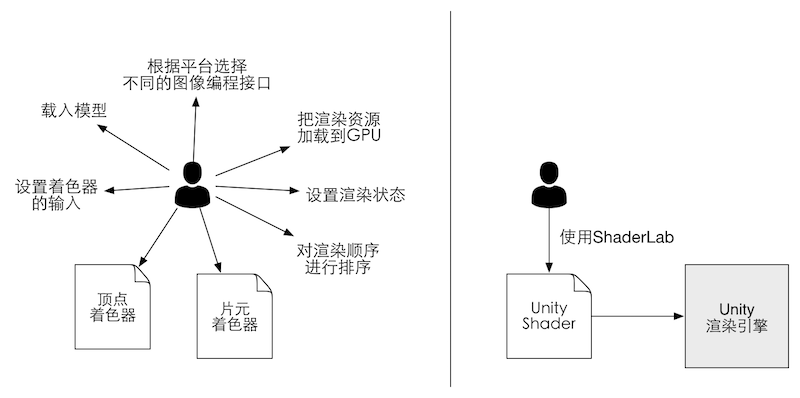
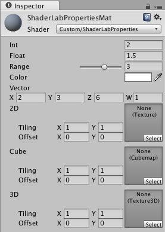

## 《Unity Shader入门精要》笔记（二）Unity Shader基础


----
#### 1、材质和Unity Shader

##### 1.1 概述
Unity中需要配合使用**材质（Material）**和**Unity Shader**才能达到需要的效果。常见流程：
```
(1) 创建一个材质;
(2) 创建一个Unity Shader，并把它赋给上一步中创建的材质;
(3) 把材质赋给要渲染的对象;
(4) 在材质面板中调整Unity Shader的属性，以得到满意的效果.
```

Unity Shader定义了渲染所需的各种代码、属性和指令；材质则允许我们调整这些属性，并将其最终赋给相应的模型。通俗讲就是：Shader制定了渲染的规则，材质是让这个物体在这个规则下调整渲染效果。

##### 1.2 材质
材质结合GameObject的Mesh或Particle Systems组件来工作。

Unity新建的材质，默认使用Standard Shader。

##### 1.2 Unity Shader
Unity提供了4种Unity Shader模板:
```
(1) Standard Surface Shader
产生一个包含标准光照模型的表面着色器.

(2) Unlit Shader
产生一个不包含光照（但包含雾效）的基本的定点/片元着色器.

(3) Image Effect Shader
屏幕后处理的基本模板.

(4) Compute Shader
特殊的Shader文件，利用GPU的并行性进行一些与常规渲染流水线无关的计算.
```


----
#### 2、Unity Shader的基础：ShaderLab
Unity Shader是Unity为开发者提供的高层级的渲染抽象层，为我们自定义渲染效果提供遍历，防止和很多文件、设置打交道。



ShaderLab是编写Unity Shader的一种说明性语言，所有Unity Shader都是用ShaderLab编写的。它使用一些嵌套在花括号内部的语义（syntax）来描述Unity Shader文件的结构


----
#### 3、Unity Shader结构
ShaderLab的语义有：Properties、SubShader、Fallback等，这些语义定义了Unity Shader的结构。

Unity Shader基础结构：
```
Shader "ShaderName" {
    Properties {
        // 属性
    }

    SubShader {
        // 显卡A使用的子着色器
    }

    SubShader {
        // 显卡B使用的子着色器
    }

    Fallback "VertexLit"
}
```

##### 3.1 Shader命名
通过Shader语义指定当前Unity Shader的名字，名字由字符串定义，字符串内可添加斜杠（"/"）对Shader进行分组管理：
```
Shader "Custom/MyShader" { }
```

##### 3.2 Properties
Properties语义块包含一系列属性（Property），这些属性是材质和Unity Shader连通的桥梁。
```
// 注：
// Name是Shader访问该属性的变量名，通常以一个下划线开始.
// display name是Shader在材质面板上看到的属性名称.
// PropertyType是当前属性的类型，Unity Shader的属性类型.
// DefaultValue是当前属性的默认值.

Properties {
    Name ("display name", PropertyType) = DefaultValue
    Name ("display name", PropertyType) = DefaultValue
    // 更多属性
}
```

Properties语义块支持的属性类型：

| 属性类型 | 默认值的定义语法 | 例子 |
| ---- | ---- | ---- |
| Int | number | _Int("Int", Int) = 2 |
| Float | number |  _Float("Float", Float) = 1.5 |
| Range(min, max) | number |  _Range("Range", Range(0.0, 5.0)) = 3.0 |
| Color | (number,number,number,number) |  _Color("Color", Color) = (1,1,1,1) |
| Vector | (number,number,number,number) |  _Vector("Vector", Vector) = (2,3,6,1) |
| 2D | "defaulttexture"{} |  _2D("2D", 2D) = ""{} |
| Cube | "defaulttexture"{} |  _Cube("Cube", Cube) = "white"{} |
| 3D | "defaulttexture"{} |  _3D("3D", 3D) = "black"{} |

不同属性类型在材质
面板中的显示结果:



##### 3.3 SubShader
每个Unity Shader里至少包含一个SubShader语义块，可以有多个SubShader。Unity Shader可以定义不同的SubShader来适应不同平台的显卡.

SubShader语义块：
```
SubShader {
    // 可选的
    [Tags]

    // 可选的
    [RenderSetup]

    Pass {
    }

    // Other Passes
}
```
SubShader中可定义很多**Pass**和一些可选的**状态（RenderSetup）**和**标签（Tags）**.

每个Pass定义一次完整的渲染流程，Pass数量越多，渲染性能消耗越大.

状态和标签也可以在Pass中定义，但Pass中使用的标签是特定的，在SubShader中定义的状态会应用于里面的所有Pass.

- **(1) 状态设置**

ShaderLab中常见的渲染状态设置选项：

| 状态名称 | 设置指令 | 解释 |
| ---- | ---- | ---- |
| Cull | Cull Back &#124; Front &#124; Off | 设置剔除模式：剔除背面&#124;正面&#124;关闭 |
| ZTest | ZTest Less Greater  &#124; LEqual  &#124; GEqual &#124; Equal &#124; NotEqual  &#124; Always | 设置深度测试时使用的函数 |
| ZWrite | Zwrite On &#124; Off | 开启/关闭深度写入 |
| Blend | Blend SrcFactor DstFactor | 开启并设置混合模式 |

- **(2) SubShader的标签**

SubShader的标签块支持的标签类型：

| 标签类型 | 说明 | 例子 |
| ---- | ---- | ---- |
| Queue | 控制渲染顺序，指定当前SubShader渲染的物体在哪个渲染队列. | ---- |
| RenderType | 对着色器进行分类，比如：不透明的着色器、透明的着色器。可被用于着色器替换功能. | ---- |
| DisableBatching | 控制是否禁用批处理，涉及模型空间计算时，需要禁用，因为批处理会让模型坐标丢失，比如：顶点动画. | ---- |
| ForceNoShadowCasting | 控制当前SubShader渲染的物体是否会向其他物体投射阴影. | ---- |
| IgnoreProjector | 控制当前SubShader渲染的物体是否不接受其他物体投射的阴影，通常用于半透明物体. | ---- |
| CanUseSpriteAtlas | 若当前SubShader用于精灵时，将标签设置为“False”. | ---- |
| PreviewType | 控制材质面板上显示的预览样式，默认球形，此外还可以设置为“Plane”、“SkyBox” | ---- |

- **(3) Pass语义块**
```
Pass {
    [Name]
    [Tags]
    [RenderSetup]

    // Other code
}
```

【Name】通过Pass的名称，可以使用ShaderLab的UsePass命令来直接使用其他Unity Shader中的Pass，提高Shader代码复用性

【Tags】SubShader的Tags同样适用于Pass，但Pass的Tags不能用于SubShader。

一些特殊的Pass：
```
UsePass
使用该指令，复用其他的Pass。

GrabPass
该Pass负责抓取屏幕并将结果存储在一张纹理中，以用于后续的Pass处理。
```

----
#### 4、Unity Shader的形式
Unity Shader的形式有：表面着色器、顶点着色器、片元着色器、固定函数着色器。
```
Shader "ShaderName" {
    Properties {
        // 所需的各种属性
    }

    SubShader {
        // 真正意义上的Shader代码会出现在这里
        // 表面着色器（Surface Shader）或者
        // 顶点/片元着色器（Vertex/Fragment Shader）或者
        // 固定函数着色器（Fixed Function Shader）
    }

    SubShader {
        // 与上一个shader类似
    }
}
```

##### 4.1 表面着色器（Surface Shader）
本质是顶点/片元着色器，是Unity内置的更高一层的抽象，Unity内部处理了很多光照细节，代码量更少，但渲染代价比较大。

表面着色器代码使用CG/HLSL编写，写在CGPROGRAM和ENDCG之间。

表面着色器的代码定义在SubShader语句块中，案例代码：
```
Shader "Custom/Simple Surface Shader" {
    SubShader {
        Tags {"RenderType" = "Opaque"}

        CGPROGRAM

        #pragma surface surf Lambert

        struct Input {
            float4 color : COLOR;
        };

        void surf(Input IN, input SurfaceOutput o) {
            o.Albedo = 1;
        }

        ENDCG
    }

    Fallback "Diffuse"
}
```

##### 4.2 顶点/片元着色器（Vertex/Fragment Shader）
定点着色器、片元着色器使用CG/HLSL编写，写在CGPROGRAM和ENDCG之间。

顶点/片元着色器的代码定义在Pass语句块中，案例代码：
```
Shader "Custom/Simple VertexFragment Shader" {
    SubShader {
        Pass {
            CGPROGRAM

            #pragma vertex vert
            #pragma fragment frag

            float4 vert(float4 v : POSITION) : SV_POSITION {
                return mul(UNITY_MATRIX_MVP, v);
            }

            fixed4 frag() : SV_Target {
                return fixed4(1.0, 0.0, 0.0, 1.0);
            }

            ENDCG
        }
    }
}
```

##### 4.3 固定函数着色器（Fixed Function Shader）
固定函数着色器不像前两类着色器一样，它不支持可编程，用于比较老的，不支持可编程渲染管线着色器的设备中，目前基本被淘汰。案例代码：
```
Shader "Custom/Simple VertexFragment Shader" {
    SubShader {
        Pass {
            CGPROGRAM

            #pragma vertex vert
            #pragma fragment frag

            float4 vert(float4 v : POSITION) : SV_POSITION {
                return mul(UNITY_MATRIX_MVP, v);
            }

            fixed4 frag() : SV_Target {
                return fixed4(1.0, 0.0, 0.0, 1.0);
            }

            ENDCG
        }
    }
}
```

##### 4.4 选择哪种Unity Shader形式？
- 如果需要跟各种光源打交道，建议使用表面着色器，但是需要留意移动平台的性能；
- 其他情况下，建议使用顶点/片元着色器；
- 若需要更多自定义的渲染效果，也建议使用顶点/片元着色器。
